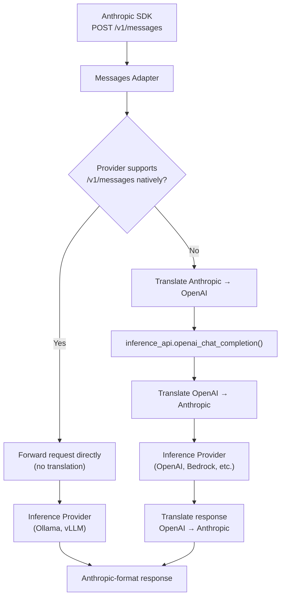

# Anthropic Messages API

OGX provides native support for the Anthropic Messages API at `/v1/messages`. Point the official Anthropic SDK at your OGX server and use any model.

```python
from anthropic import Anthropic

client = Anthropic(base_url="http://localhost:8321/v1", api_key="fake")
message = client.messages.create(
    model="llama-3.3-70b",
    max_tokens=1024,
    messages=[{"role": "user", "content": "Hello"}],
)
```

## How it works

The Messages adapter checks whether the configured inference provider natively supports the `/v1/messages` endpoint. If it does, the request is forwarded directly. Otherwise, the adapter translates between Anthropic and OpenAI formats.



**Translation path** (most providers): the adapter converts the full request and response between formats:

- **Request**: Anthropic `system`, `messages`, `tools`, `tool_choice`, `stop_sequences`, and (for reasoning models) `thinking` are mapped to their OpenAI equivalents
- **Response**: OpenAI completions are converted back to Anthropic format, including `content` blocks, `stop_reason`, and `usage`
- **Streaming**: OpenAI streaming chunks are transformed into Anthropic SSE events (`message_start`, `content_block_delta`, `message_delta`, etc.)
- **Tool use**: Anthropic `tool_use` / `tool_result` blocks are translated to and from OpenAI `tool_calls` / `tool` messages

**Passthrough path** (Ollama, vLLM): the request is forwarded directly to the provider's `/v1/messages` endpoint without any translation, since these providers natively speak the Anthropic format.

## Implemented endpoints

| Endpoint | Method | Description |
|----------|--------|-------------|
| `/v1/messages` | POST | Create a message (streaming and non-streaming) |
| `/v1/messages/count_tokens` | POST | Count tokens for a message |

## Supported features

- System messages (string or content blocks)
- Multi-turn conversations
- Streaming via Server-Sent Events
- Tool definitions and tool use
- Extended thinking (thinking blocks), for reasoning models
- Temperature, top_p, top_k, stop sequences
- Token counting

## Extended thinking

On the translation path, `thinking` is supported for reasoning models. Providers that forward to a native `/v1/messages` endpoint (Ollama, vLLM) pass `thinking` through unchanged.

| Request | Backend request |
|---------|-----------------|
| `thinking: {"type": "enabled", "budget_tokens": N}` | `reasoning_effort`: `low` for N up to 2048, `medium` up to 8192, `high` above. `medium` when `budget_tokens` is omitted |
| `thinking: {"type": "adaptive"}` | Accepted with no explicit effort, so the backend's own default applies |
| `thinking: {"type": "disabled"}` or omitted | No reasoning control. Any reasoning text the backend returns is not surfaced |

When thinking is requested, reasoning text returned by the backend (`reasoning_content` or `reasoning`, as vLLM, DeepSeek and Ollama return it) becomes a leading `thinking` content block. Streaming responses emit it as `thinking_delta` events before the answer. The block's `signature` is empty because nothing signs it.

A request with `thinking` enabled or adaptive for a model that is not known to reason fails with a 400 (`Failed to process thinking request`) instead of dropping the field. A model counts as a reasoning model when the [models.dev](https://models.dev) registry lists it as one, or when its name matches a well-known reasoning family (`gpt-oss`, OpenAI o-series and `gpt-5`, `deepseek-r1`, `qwq`, `qwen3`, and names containing `thinking`). Unknown models are treated as not reasoning.

Limits:

- `budget_tokens` selects a coarse effort level. It is not enforced as a token cap.
- Backends that do not return reasoning text (OpenAI's Chat Completions API does not for o-series and `gpt-5` models) accept the request and apply the effort, but the response has no `thinking` block.

## Not yet implemented

- Message Batches (`/v1/messages/batches`)

For property-level conformance details and missing properties, see the [conformance report](/docs/api-anthropic-messages/conformance).
